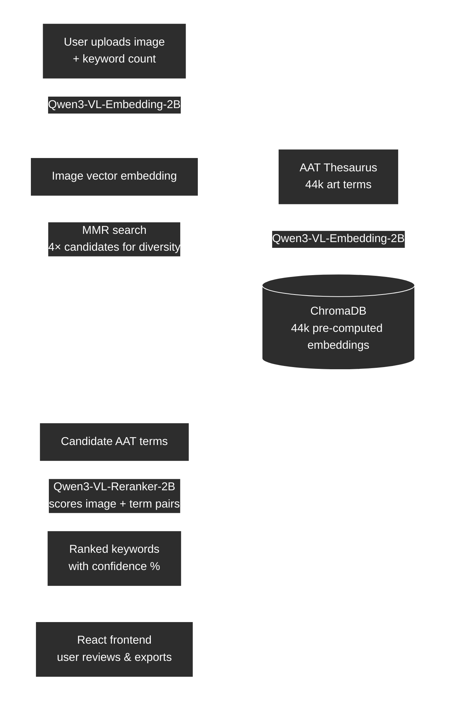

# Mills Art Museum Project: Generating AAT Keywords for the Museum Collection

# Goal

Labeling Art Museum pieces has previously been a tedious and time-consuming task at the Mills College Art Museum. 
In light of recent advancements in image recognition and object categorization, the goal of this project is to lay the stones,
for potential future applications of modern AI and ML techniques to the general art community. 

# Background & Why

At Mills College, museum staff each assign each art piece a keyword that best represent the piece's content, from a 
total collection of 50,000 keywords. This has slowed down the labeling process and has resulted in a large number of 
pieces not being labeled, and highlighted the need for a more streamlined & automated process.

# How?

This project can be devided into two parts:
1. A central user interface to generate AAT keywords for the entire collection of art pieces
2. A pipeline to handle unique AAT datasets, their respective refinement, cleaning, and finally matching process for each museum piece.

## User Interface
The user interface connects museum staff to the labeling pipeline: a single place to upload artwork images, watch processing progress, and review model-generated AAT keyword suggestions. Staff can include or exclude individual keywords before copying or exporting results; batch uploads are supported with navigation between images.

### Specs

**Stack.** The web app lives under `src/frontend/mcam-keyword-generator/`. It is built with **React 18**, **Vite 5**, and **Tailwind CSS v4**, with **Lucide React** for icons and **Motion** for light transitions on key screens.

**Design choices.** The UI uses a **dark slate** gradient background and card surfaces with subtle rings so attention stays on the artwork and keyword list. **Amber and orange** accents mark primary actions (for example, “Generate Keywords”) and **selected** keyword tiles so recommendations read as reviewable highlights rather than plain text. The header shows a simple **phase** indicator (Ready / Processing / Review) so the flow stays obvious: **Upload → Processing → Review**.

**Screens (implemented behavior).**

- **Upload:** Image preview with drag-and-drop or file picker; multiple files with prev/next preview. Users set how many keywords to request (**1–50**, default **20**) via a range slider and number field, then run **Generate Keywords**.
- **Processing:** Progress bar, current image preview, and a status line (for example, which image in a batch is running).
- **Review:** For each image, a large preview plus filename; a **keyword grid** showing **term name** and **confidence percentage** (definitions appended in API labels are stripped for display). Each keyword has a **checkbox** to include or exclude it from copy and export. Users can **filter** the list, **copy** included keywords, download a **per-image TXT** export, and **export all** batch results to a single text file. When multiple images are processed, prev/next moves between results; errors for individual files are surfaced in the review flow.

**API and configuration.** The client calls `POST {VITE_API_URL}/predict` with **multipart form data**: `file` (image) and `term_count` (integer string, clamped 1–50 in the app). Set `VITE_API_URL` in `.env.local` (for example, your ngrok URL). The request sends an `ngrok-skip-browser-warning` header for compatibility with ngrok-hosted backends. The backend should return JSON shaped like `{ "keywords": [ { "label" or "text": "...", "score": <number> }, ... ] }`. Scores are treated as percentages in the UI (see `mapApiKeyword` in `src/frontend/mcam-keyword-generator/src/utils/keywordAdapters.js`); long labels that include `"term : definition"` are trimmed to the term name for display only.

**Local development.** From the repo root: `npm -C src/frontend/mcam-keyword-generator install` then `npm -C src/frontend/mcam-keyword-generator run dev`. A mock backend is available via `npm -C src/frontend/mcam-keyword-generator run mock` (default `http://localhost:8000`).

## Pipeline
The pipeline is the core of the project; it encompasses the entire process of filtering, cleaning, and matching 
AAT keywords to art pieces. This allows user the staff to have a streamlined process, from separate museum collections and
ATT keyword dataset.

### Specs

Our pipeline is implemented in the Python programming language, due to the familiarity of the team with the language as well as the prominence of machine learning libraries and wrappers for the language. Powerful libraries such as pytorch make Python a premiere choice for machine learning work across the industry.

For our machine learning models, we chose Qwen3VL Embedder and Reranker models. These models have the benefit of being open-weight, which allows us to easily make any necessary adjustments easily, as well as being (close to) State of The Art in this space. Qwen as a whole is a rising force in the AI model space, with their propensity to release a wide range of variants and sizes for their models (as well as the previously mentioned open weights) making them particularly popular among local hosting and finetuning circles. The Embedder model generates embeddings based on the image, associating them with specific concepts; in our case, we fit the embedding model onto a filtered version of the AAT terms so that the embeddings it would generate are AAT terms. The Reranker model takes the embeddings generated and re-ranks them, which allows us to further refine the output and increase the quality of results.

The pipeline is primarily designed around using Google Colab, as their rather generous educational benefits package has given us access to far more powerful hardware than we would otherwise have access too, and in general the platform allows for workflows to be very easily shared and used. We also believe that Colab's pay-as-you-go style of pricing will be very attractive to small museums, as it means that they only pay for what they use and they don't need to worry about the various costs of maintaining infrastructure or hardware themselves.

