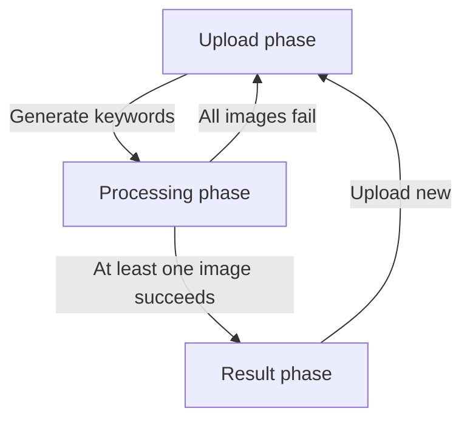
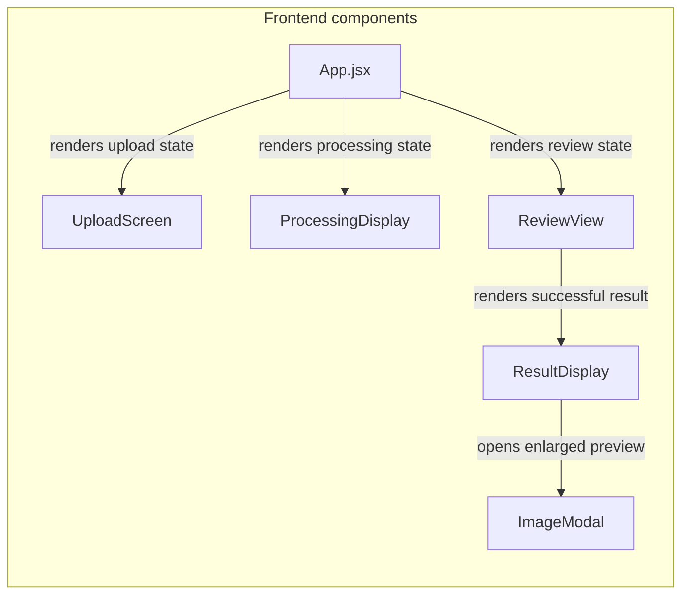
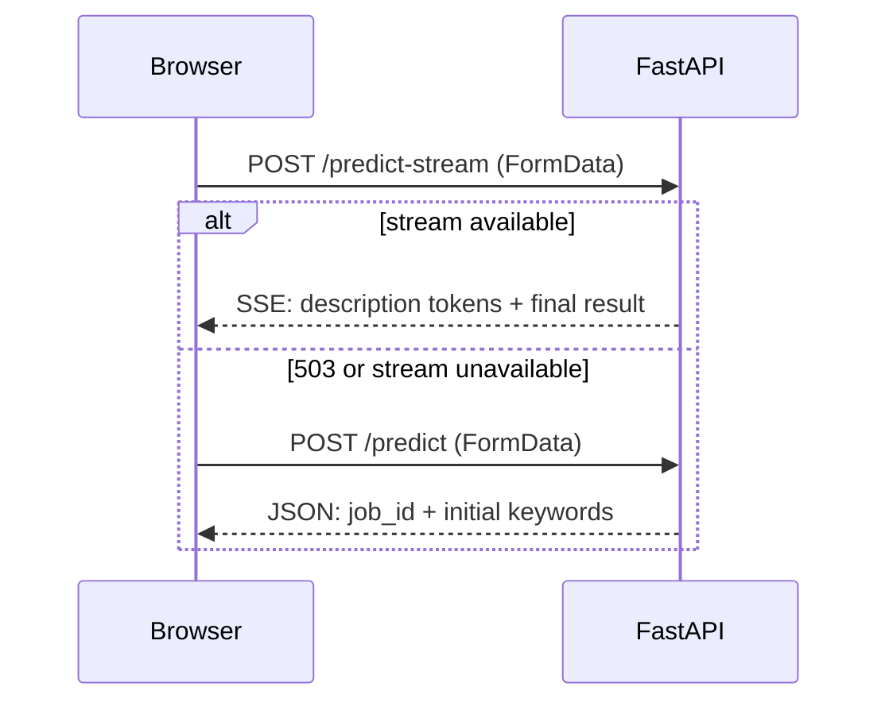
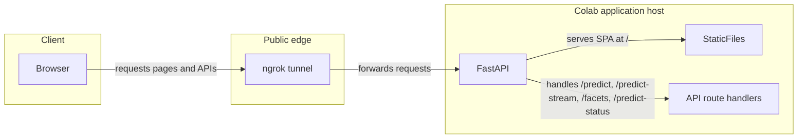

# Frontend + API Connection Architecture

## Frontend Architecture Overview

The MCAM frontend is a React single-page application (SPA) under `src/frontend/web/src`, bootstrapped from `main.jsx`, which mounts `App` into `#root`. `App.jsx` is the top-level orchestrator and implements a three-phase UI state machine:

- `upload`: file selection and parameter configuration
- `processing`: in-flight status for the active batch
- `result`: review/export experience for successful and failed rows

Phase transitions are driven by `handleRequestProcess()` and post-processing actions (`handleUploadNew()`), with conditional rendering for one phase view at a time.



## Component Hierarchy

`App.jsx` owns canonical application state (`phase`, `results`, `resultIndex`, processing progress/description/status) and passes down focused props and callbacks to children.

- `UploadScreen` receives:
  - `onRequestProcess(files, termCountOrMap, lambdaMult, queryBias)`
  - `errorMessage`
  - `onDismissError`
- `ProcessingDisplay` receives:
  - `progress`
  - `imageSrc`
  - `keywords` (currently passed as `[]` during processing)
  - `statusLabel`
  - `description`
  - `descriptionDone`
  - `processingStatus`
- `ReviewView` receives:
  - `results`
  - `resultIndex`
  - `setResultIndex`
  - `onUploadNew`
  - `onKeywordsChange`

`ReviewView` renders either:

- an inline error panel when the current row is failed, or
- `ResultDisplay` for successful rows.

`ResultDisplay` manages review-only UI state (filter, grouping, heatmap toggle, modal visibility, copied state) and renders `ImageModal` for enlarged preview.



## API Communication Layer

### Request strategy in `App.jsx`

For each file in the batch, `App.jsx` executes a stream-first strategy:

1. Build `FormData`.
2. `POST /predict-stream` first.
3. If streaming is unavailable/fails in the expected fallback path (notably `503`), call `POST /predict`.
4. Store initial keyword payload and `job_id` in `results`.
5. Start async polling via `useRerankPolling` for progressive score updates.

### `FormData` fields sent by the frontend

`App.jsx` sends these fields:

- `file`
- either `term_count` **or** `hierarchy_counts` (JSON string map)
- `lambda_mult` (when provided)
- `query_bias` (streaming path; passed from upload settings)

### `/facets` bootstrap call in `UploadScreen`

`UploadScreen.jsx` runs a one-time fetch on mount:

- `GET ${VITE_API_URL || "http://localhost:8000"}/facets`
- Uses `data.hierarchies` to populate per-hierarchy slider controls and defaults.

### Async score updates via `useRerankPolling`

`useRerankPolling.js` polls:

- `GET /predict-status/{job_id}` every `1500ms`
- stops when status is `done` or `error`
- reports progressive completion and keyword score changes

This polling exists because prediction returns keyword candidates quickly, while rerank score computation completes asynchronously afterward.



```mermaid
%% Diagram: Async score polling
sequenceDiagram
  participant browser as Browser
  participant fastApi as FastAPI

  loop until rerank complete
    browser->>fastApi: GET /predict-status/{job_id}
    fastApi-->>browser: JSON: status + updated scores
  end
  Note over browser, fastApi: "Keywords appear first; scores fill in as polling runs."
```

## Static Serving Architecture

### Build artifact

`src/frontend/web/package.json` defines `npm run build` as `vite build`, producing static assets in:

- `src/frontend/web/dist/`

### Setup Paths behavior in Colab

In `colab/mcam_server.ipynb` Setup Paths cell:

- notebook clones/pulls repo source
- checks whether `src/frontend/web/dist` exists
- if missing: runs `npm install` and `npx vite build`
- if present: skips build (`Frontend dist/ already exists, skipping build`)

### Production serving topology

In the notebook API Server cell:

- `DIST_PATH` is set to `.../src/frontend/web/dist`
- FastAPI mounts static frontend at root:
  - `app.mount("/", StaticFiles(directory=DIST_PATH, html=True), name="frontend")`
- API endpoints remain mounted on the same host:
  - `/predict`
  - `/predict-stream`
  - `/predict-status/{job_id}`
  - `/facets`
- ngrok exposes FastAPI on a single public origin.

### Why this matters

Because SPA pages and API routes share the same origin in production, browser requests are same-origin by default, which avoids separate frontend/backend origin coordination and additional CORS setup complexity for client calls.



## Key Design Decisions

### React + Vite over Gradio

The primary UI uses React + Vite to support stronger layout/theming control and closer design fidelity to the Figma-driven interface than Gradio-based surfaces.

### Static `dist` served through FastAPI in Colab

Serving built assets via FastAPI (instead of running a separate frontend dev server in Colab) creates one user-facing origin for both pages and API calls, which simplifies deployment and usage for non-technical stakeholders.

### Default-included keyword behavior

`isKeywordIncluded(k)` in `utils/keywordAdapters.js` returns `k.selected !== false`, intentionally treating missing `selected` fields as included by default.

### Async rerank polling over blocking responses

The frontend shows candidate keywords quickly, then progressively applies scores from `/predict-status/{job_id}`. This reduces perceived latency compared to waiting for all scoring work to complete before rendering.

### SSE-first with REST fallback

`App.jsx` attempts `/predict-stream` first for streamed AI description/status and result handoff. If unavailable, it falls back to `/predict`, preserving core keyword generation even when stream/caption capability is not available.
