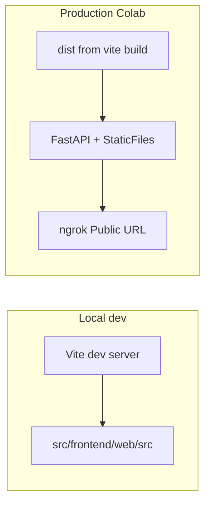

# MCAM Keyword Generator — Technical Handover

This document orients a new developer joining the Mills Museum (MCAM) keyword tooling work: how the repository is laid out, how to run the React app locally versus in production on Google Colab, and where the important code lives.

---

## Project Overview

The **MCAM Keyword Generator** is a browser-based workflow for **Mills College Art Museum** staff and collaborators: upload artwork images, receive **Art & Architecture Thesaurus (AAT)**–style keyword suggestions with confidence scores, curate them (include/exclude), and export results (including CSV shaped for tools like EmbARK). The **frontend** is **React 18** with **Vite 5**, **Tailwind CSS v4**, **Motion** (the Framer-maintained animation library, successor to `framer-motion` on npm), and **Lucide React** icons. The **runtime stack** that serves both the built UI and the inference API lives in a **Google Colab** notebook: **FastAPI** + **uvicorn**, **ChromaDB** for the vector store, **LangChain**’s `langchain-chroma` wrapper for MMR retrieval, optional vision captioning via **llama.cpp**’s server, and a public **ngrok** tunnel so users hit a single HTTPS URL. This handover focuses on the **primary** web app under `src/frontend/web/`; older **Gradio** UIs still exist under `src/frontend/` but are not the main product surface.

---

## Repository Structure

| Path | Purpose |
|------|---------|
| **`colab/`** | **`mcam_server.ipynb`** — clone/pull repo, download VDB, load models, start FastAPI + static frontend + ngrok. **`embed_aat_keywords.ipynb`** — embedding pipeline companion. |
| **`docs/`** | **`mcam-keyword-generator-user-guide.md`** — non-technical staff guide. **`technical-handover.md`** — this file. |
| **`media/`** | Shared assets (e.g. **`logo.png`**) imported by the Vite app from the repo root; **`vite.config.mjs`** uses `server.fs.allow` so that import works in dev. |
| **`scripts/`** | Hugging Face upload helpers (`hf_upload_scripts/`), data pipeline utilities (`pipeline/`). |
| **`src/analysis/`** | Parquet caches, dashboards, figures (separate from the keyword web app). |
| **`src/frontend/web/`** | **Main React + Vite application**: `src/` (components, hooks, utils), `vite.config.mjs`, `package.json`, `index.html`, `public/`. |
| **`src/frontend/`** | Legacy **`gradio.py`**, **`keyword_feedback.py`**, design/Figma assets — not the path for the Vite app. |
| **Root** | `README.md`, `LICENSE`, `pyproject.toml` / `requirements.txt` (Python for analysis/pipeline; Colab installs its own deps), root **`package.json`** (optional npm scripts — should point at `src/frontend/web`). |

### `dist/` (production build) — intended workflow vs current repo

**Intended deployment story:** The production UI is the **static output** of `npm run build` (folder **`src/frontend/web/dist/`**). **FastAPI** in Colab mounts that directory at the site root so the **same origin** serves HTML/JS/CSS and `/predict*`, `/facets`, etc. Committing a fresh **`dist/`** to Git means Colab can **`git pull`** and serve immediately **without** running `npm install` / `vite build` on every session—important on **slow Colab free-tier** runtimes and for a simpler notebook.

**Current repository state (verify after clone):** Both the **root** `.gitignore` (`dist/`) and **`src/frontend/web/.gitignore`** (`dist`, `dist-ssr`) **ignore** the build output. So **`dist/` is not tracked today**. The Colab **Setup Paths** cell therefore often runs **`npm install`** + **`vite build`** when `dist/` is missing after clone. To adopt the **committed-artifact** workflow: remove or narrow those ignore rules, run `npm run build` in `src/frontend/web`, and commit `dist/`. Until then, document for the team: **pushing only TS/JS source changes does not update what Colab serves** unless someone rebuilds and commits `dist/`, or Colab rebuilds after deleting `dist/`.

---

## System Prerequisites

Install these on your laptop before local frontend work:

| Requirement | Notes |
|-------------|--------|
| **Node.js** | The repo does **not** pin a version (`engines` / `.nvmrc` absent). Use a current **Node LTS** (e.g. 20.x or 22.x) and a matching **npm**. |
| **npm** | Comes with Node; used for `npm install`, `npm run dev`, `npm run build`. |
| **Git** | For clone, branch work, and pushing `dist/` if your team enables that. |
| **Google account** | To open and run **`colab/mcam_server.ipynb`**. |
| **ngrok account + authtoken** | Free tier is enough to start; token stored as Colab **Secret** `NGROK_TOKEN` for the notebook. |

**Python:** You do **not** need a local Python env to hack the React UI. Training/server Python dependencies are installed **inside Colab** by the notebook. Optional: project `requirements.txt` / `pyproject.toml` for analysis scripts.

---

## Two Workflows: Local Development vs Production

These are **different** entry points with different goals.

### Local development (`npm run dev`)

- **Where:** `src/frontend/web` (see [Frontend Installation](#frontend-installation-for-local-development)).
- **What happens:** **Vite** serves the app from **`src/`** with HMR—edit components and see updates without running `vite build`.
- **Backend:** The app calls URLs derived from **`VITE_API_URL`** (see `App.jsx`, `UploadScreen.jsx`) defaulting to `http://localhost:8000` if unset. For a **remote** Colab/ngrok backend, set **`VITE_API_URL`** in **`.env.local`** to the tunnel origin (no trailing slash path needed for how the code concatenates paths).
- **Dev proxy:** [`vite.config.mjs`](../src/frontend/web/vite.config.mjs) sets `server.proxy['/predict']` → a **placeholder** ngrok URL. Vite matches path **prefix**, so **`/predict-stream`** and **`/predict-status/...`** are proxied the same way. **`/facets`** does **not** start with `/predict`, so **`fetch` to `/facets` still needs `VITE_API_URL`** (or add a separate `'/facets'` proxy entry).
- **`dist/`:** **Not required** for local dev.

### Production (static build + Colab)

- **Build:** From `src/frontend/web`, run **`npm run build`** → output in **`dist/`**.
- **Deploy:** Push the repo (including **`dist/`** if your team tracks it—see above). On Colab, the **git pull** cell updates the tree; **FastAPI** mounts **`.../src/frontend/web/dist`** with `StaticFiles(..., html=True)` at **`/`**.
- **Single URL:** **ngrok** exposes port **8000**; users open one **Public URL** for both SPA and API—no separate frontend host, minimal CORS friction for same-origin fetches.

### Critical warning

If **`dist/`** in the clone is **stale** or **committed** and you only push **source** changes without rebuilding (or without letting Colab rebuild after wiping `dist/`), **the live Colab-served UI will not show your edits**. Always **`npm run build`** and commit/update **`dist/`** (or force Colab rebuild) when production must reflect frontend changes.



---

## Frontend Installation for Local Development

1. **Clone** the repository and `cd` into it.
2. **Open the frontend package directory** (exact path from repo root):
   ```bash
   cd src/frontend/web
   ```
3. **Install dependencies:**
   ```bash
   npm install
   ```
4. **Configure the API base URL**
   - Create **`.env.local`** in `src/frontend/web` (gitignored via `*.local`) with:
     ```bash
     VITE_API_URL=https://your-subdomain.ngrok-free.app
     ```
     Use the same origin your Colab notebook prints (no path suffix). This drives `App.jsx` fetches and `UploadScreen`’s `/facets` request (`API_HINT`).
   - Optionally update **`server.proxy['/predict']`** in [`vite.config.mjs`](../src/frontend/web/vite.config.mjs) to the same ngrok origin so `/predict*` can work even when `VITE_API_URL` is unset—but **`/facets` still needs `VITE_API_URL`** unless you add a proxy for it.
5. **Start dev server:**
   ```bash
   npm run dev
   ```
6. Open the **localhost** URL and port Vite prints (default **5173** unless busy).

---

## Colab Workflow

1. Open **[`colab/mcam_server.ipynb`](../colab/mcam_server.ipynb)** in **Google Colab**.
2. In Colab **Secrets** (key icon), add **`NGROK_TOKEN`** with your ngrok authtoken; grant the notebook access. **`HF_TOKEN`** is used for Hugging Face if required by your VDB/models.
3. **Run cells in order** (high level):
   - **Dependencies / login** — pip installs, HF login, optional GPU checks.
   - **Configuration** — collection name, embedding type, VDB repo, optional **`rm -rf .../src/frontend/web/dist`** to force a frontend rebuild on next setup.
   - **Setup Paths** — **`git clone`** or **`git fetch` / `checkout` / `pull`** using **`subprocess.run(..., cwd=repo_path)`**. Using **`cwd=`** is deliberate: a pattern like `os.system("cd /content/Mills-Museum && git pull")` relies on a shell; **`subprocess.run(["git", "pull"], cwd=repo_path)`** sets the working directory for that process explicitly and avoids brittle subshell **`cd`** behavior.
   - **Frontend build** — if **`dist/`** is missing, **`npm install`** + **`npx vite build`** in `src/frontend/web`; otherwise “skipping build”.
   - **Load vector store / embedding model / reranker / captioner** — heavy cells; follow notebook order.
   - **API Server** (last code cell) — constructs **FastAPI** app, registers routes, mounts **`DIST_PATH`** static files at **`/`**, starts **uvicorn**, prints **ngrok** **Public URL**.
4. **Copy the printed Public URL** and share it with testers; keep the Colab runtime **alive** while the demo is in use.

---

## Frontend Codebase Guide

Paths relative to **`src/frontend/web/src/`** unless noted.

### `App.jsx`

- **Phase state machine:** `phase` is `'upload' | 'processing' | 'result'`. Maps to UI labels **Ready / Processing / Review** in the header.
- **Orchestration:** `UploadScreen` → `handleRequestProcess` loops files, tries **`POST /predict-stream`** (SSE: description tokens + final `result` message), on **503** or failure falls back to **`POST /predict`**. Builds `FormData`: `file`, `term_count` or `hierarchy_counts`, `lambda_mult`, `query_bias` (stream path).
- **Polling:** On success, `startPolling(jobId, index)` from **`useRerankPolling`** hits **`GET /predict-status/{job_id}`** to merge scores into keywords while preserving per-keyword **`selected`** by matching **`text`**.

### `components/UploadScreen.jsx`

- File queue, drag-drop, preview object URLs, **Generate Keywords** → parent callback.
- Settings: keyword count 1–50, per-hierarchy sliders (from **`GET /facets`** → `hierarchies`), query bias, MMR lambda.
- **`useEffect`** fetches **`${VITE_API_URL ?? 'http://localhost:8000'}/facets`** once on mount.

### `components/ProcessingDisplay.jsx`

- Shows progress bar, status label, optional streaming **AI Description**.
- **`App.jsx` passes `keywords={[]}`** during processing, so **no keyword tiles** appear in this phase; full interactive grid is **Review** only.

### `components/ReviewView.jsx`

- Selects current row from **`results[resultIndex]`**; **`type === 'error'`** → error panel; **`type === 'success'`** → **`ResultDisplay`** with **`nav`** (prev/next, batch export, upload new).

### `components/ResultDisplay.jsx` + `ImageModal.jsx`

- **`ResultDisplay`:** Keyword grid, checkbox inclusion, filter, group-by-hierarchy, heatmap mode, scope notes, rerank progress bar, per-image TXT/CSV/copy; batch actions via **`nav`**.
- **`ImageModal`:** Full-screen image, escape/backdrop close, body scroll lock.

### `hooks/useRerankPolling.js`

- **Why:** Reranking runs **asynchronously** on the server after initial keywords return; polling **`/predict-status`** updates **`completed`/`total`** and keyword **`score`** fields until **`status`** is `done` or `error`.
- **Implementation:** `setInterval` per `jobId`, consecutive failure cap, `stopAll` on unmount/navigation when parent calls it.

### `utils/keywordAdapters.js`

- **`getAccessionNumberFromTitle`:** Strip file extension; if **`_`** present, keep segment **before first underscore** (museum filename convention).
- **`buildCombinedExportCsv` / per-image CSV:** Header `accession_number,keyword`; one row per included keyword; CSV escaping for commas/quotes/newlines.
- **`isKeywordIncluded`:** **`k.selected !== false`** — treats **`undefined`/missing** as **included** so new API rows default-on without an explicit `selected: true` in every code path.

### Other files

- **`main.jsx`** — React root, global CSS imports.
- **`utils/confidenceBadgeStyle.js`**, **`utils/reviewActionStyles.js`** — presentation tokens.
- **`eslint.config.js`**, **`vite.config.mjs`** — tooling (see proxy/`fs.allow` above).

---

## Key Implementation Decisions

1. **React + Vite vs Gradio** — Gradio is fast for demos but **CSS/layout control** and **Figma-faithful** museum branding are much easier in a custom React app.
2. **Static `dist/` behind FastAPI vs a second dev server in Colab** — One **origin** (one ngrok URL) for SPA + API avoids **CORS** configuration for browsers and matches how non-technical users expect “one website.”
3. **Committing `dist/` (target)** — Avoids **slow npm builds** on every Colab start; notebook stays focused on models and inference. **Today** `dist/` is gitignored—see [Repository Structure](#repository-structure).
4. **`isKeywordIncluded` as `!== false`** — Inclusive default for partial objects and poll merges; unchecked is the explicit **opt-out**.
5. **Polling vs synchronous rerank** — User sees keywords immediately with **`score: null`** (UI shows “…”); percentages fill in as the background job finishes—better perceived latency than blocking the HTTP response.

---

## Areas for Future Improvement

- **Accession / title from collection data** — Today accession is **derived from filenames** only; loading identifiers or titles from a **CSV/museum dataset** in the UI would reduce renaming friction.
- **Multi-part objects** — One catalog record, **multiple images**; UI and exports assume one file ↔ one result row.
- **Persistent review state** — Refresh loses in-memory results; **sessionStorage**, URL state, or server-side sessions could help.
- **Developer ergonomics** — Add **`/facets`** to Vite proxy or document **`VITE_API_URL`** as mandatory for local dev; fix root **`package.json`** **`--prefix`** to **`src/frontend/web`** (currently points at a non-existent path).
- **Align `dist/` policy** — Remove `dist` from **`.gitignore`** files if the team standardizes on **committed builds** for Colab.
- **TODOs in source** — No `TODO`/`FIXME` markers in `src/frontend/web/src` at last scan; continue lightweight issue tracking for refactors.

---

## Related docs

- **[MCAM Keyword Generator — User Guide](./mcam-keyword-generator-user-guide.md)** — museum staff, plain language.
- **[`colab/mcam_server.ipynb`](../colab/mcam_server.ipynb)** — authoritative server behavior and cell order.
